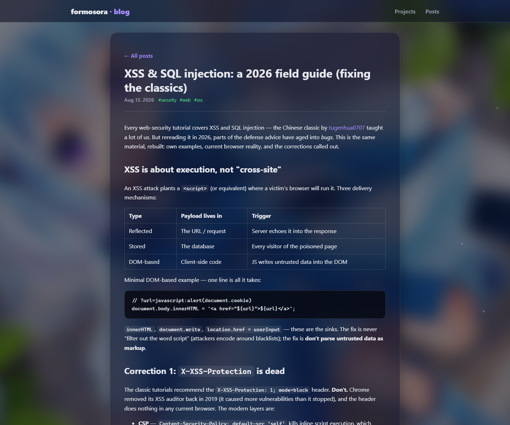

# 📝 formosora · blog

My personal blog — notes on **web development, security and Windows kernels**.
Built with **Vue 3 + TypeScript + Vite**; posts are plain Markdown files with
fully customizable display dates. Auto-deployed to GitHub Pages on every push.


## 📸 Screenshots

| Home | Post |
| ---- | ---- |
|  |  |

## ✍️ Writing a post

Drop a Markdown file into `posts/`. The filename becomes the URL slug
(`posts/my-note.md` → `/blog/post/my-note`), and the frontmatter controls
everything else:

```markdown
---
title: My post title
date: 2026-08-13          # publish date shown on the site
updated: 2026-08-14       # optional, shown next to the publish date
tags: [kernel, windows]   # optional, used for the filter chips
excerpt: Optional summary # optional; auto-generated from the body if omitted
---

Markdown content here…
```

Posts are listed newest first.

## 🚀 Develop

```bash
npm install
npm run dev       # http://localhost:5173/blog/
npm run build     # production build → dist/ (plus 404.html SPA fallback)
npm run preview   # serve the production build locally
```

## 📦 Deploy

`.github/workflows/deploy.yml` builds the site and publishes it to GitHub
Pages on every push to `main`. One-time setup: repo **Settings → Pages →
Source → GitHub Actions**.

## 🧱 Stack

| Piece | Choice |
| ----- | ------ |
| Framework | Vue 3 + Vue Router |
| Language | TypeScript |
| Content | Markdown in `posts/`, rendered with markdown-it |
| Styling | Hand-rolled CSS (custom properties, no framework) |
| Hosting | GitHub Pages (project site, base `/blog/`) |
